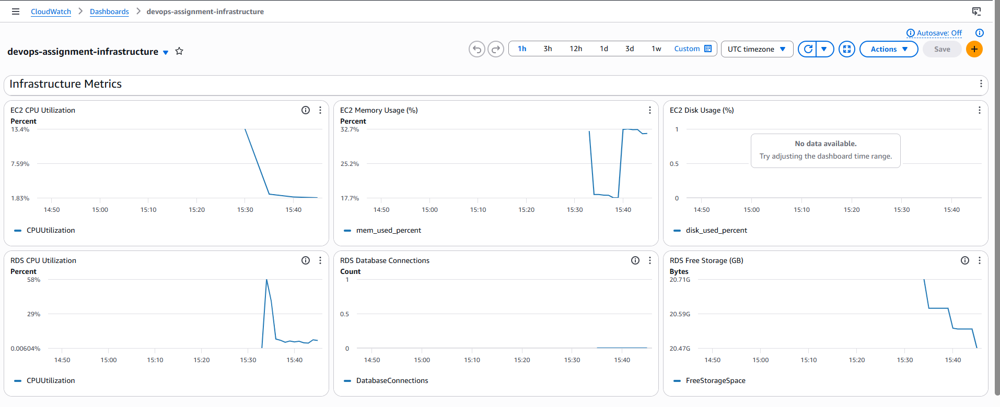
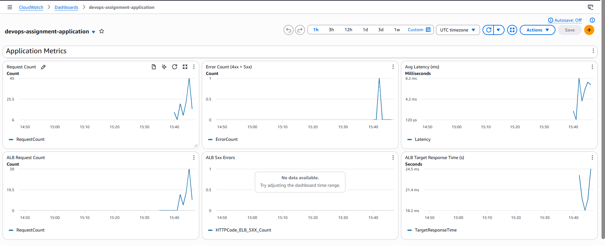

# DevOps Assignment — Octa Byte AI

A fully automated DevOps pipeline deploying a containerised Flask application on AWS, with infrastructure-as-code, CI/CD, and centralised monitoring.

---

## Architecture Overview

```
Internet
   │
   ▼
Application Load Balancer (public subnets, port 80)
   │
   ▼
EC2 Instance — Flask app in Docker (public subnet, port 5000)
   │
   ▼
RDS PostgreSQL (private subnets, port 5432)
```

| Layer | Technology |
|---|---|
| Infrastructure | Terraform 0.12, AWS VPC / EC2 / RDS / ALB |
| Application | Python Flask, PostgreSQL (psycopg2), Gunicorn |
| Containerisation | Docker (multi-stage build, non-root user) |
| CI/CD | GitHub Actions (test → scan → build → deploy) |
| Registry | DockerHub |
| Monitoring | AWS CloudWatch (agent + custom metrics + dashboards) |

---

## Part 1 — Infrastructure (Terraform)

### Resources provisioned

- **VPC** — `10.0.0.0/16` with 2 public and 2 private subnets across 2 AZs
- **Internet Gateway** — attached to the VPC for public subnet egress
- **Security Groups**
  - ALB: inbound 80/443 from internet
  - App (EC2): inbound app port from ALB only, SSH from internet (for CI/CD deployments)
  - RDS: inbound 5432 from App SG only
- **EC2** — Amazon Linux 2, public subnet, public IP, Docker + CloudWatch agent installed via user-data
- **RDS PostgreSQL 15** — private subnets, encrypted, not publicly accessible
- **ALB** — public subnets, HTTP listener → target group on port 5000, health check at `/health`
- **CloudWatch** — log groups, IAM role/instance profile, two dashboards

### Directory structure

```
terraform/
├── provider.tf        # AWS provider
├── backend.tf         # Local state backend
├── variables.tf       # All input variables
├── locals.tf          # Common tags
├── vpc.tf             # VPC, subnets, IGW, route tables
├── security_groups.tf # ALB / App / RDS security groups
├── ec2.tf             # EC2 instance, key pair, IAM profile
├── rds.tf             # RDS PostgreSQL, subnet group
├── alb.tf             # ALB, target group, listener
├── cloudwatch.tf      # Log groups, IAM role, dashboards
└── outputs.tf         # ALB DNS, EC2 IP, RDS endpoint
```

### Deploy infrastructure

```bash
cd terraform

terraform init

terraform plan \
  -var='db_password=YOUR_DB_PASSWORD' \
  -var='public_key=YOUR_SSH_PUBLIC_KEY'

terraform apply \
  -var='db_password=YOUR_DB_PASSWORD' \
  -var='public_key=YOUR_SSH_PUBLIC_KEY'
```

### Tear down

```bash
terraform destroy \
  -var='db_password=YOUR_DB_PASSWORD' \
  -var='public_key=YOUR_SSH_PUBLIC_KEY'
```

### IAM — minimum privilege policy

`iam/terraform_policy.json` contains a custom IAM policy for the Terraform deployment role covering only the actions required:

| Statement | Permissions |
|---|---|
| EC2NetworkingAndVPC | VPC, subnets, IGW, route tables, security groups |
| EC2InstancesAndEIP | Run/stop/terminate instances, key pairs, EIP |
| ElasticLoadBalancing | ALB, target groups, listeners |
| RDS | DB instances, subnet groups, parameter groups |
| IAMForEC2Role | Create/attach role and instance profile for CloudWatch |
| CloudWatchAndLogs | Dashboards, metrics, log groups |

To create or update the policy on AWS:

```bash
# Create
aws iam create-policy \
  --policy-name TerraformDeployPolicy \
  --policy-document file://iam/terraform_policy.json

# Update (replace VERSION_ID with the old version)
aws iam create-policy-version \
  --policy-arn arn:aws:iam::ACCOUNT_ID:policy/TerraformDeployPolicy \
  --policy-document file://iam/terraform_policy.json \
  --set-as-default

aws iam delete-policy-version \
  --policy-arn arn:aws:iam::ACCOUNT_ID:policy/TerraformDeployPolicy \
  --version-id VERSION_ID
```

---

## Part 2 — Application & CI/CD Pipeline

### Application

A Flask API with a user management UI backed by RDS PostgreSQL.

```
app/
├── app.py             # Flask routes + CloudWatch metrics middleware
├── requirements.txt   # Dependencies
├── Dockerfile         # Multi-stage build, non-root user
├── conftest.py        # pytest path fix
├── templates/
│   └── index.html     # User management UI
└── tests/
    └── test_app.py    # Unit tests (9 tests, DB and boto3 mocked)
```

**Endpoints:**

| Method | Path | Description |
|---|---|---|
| GET | `/` | User management UI |
| GET | `/health` | Health check (used by ALB) |
| GET | `/db` | Database connectivity check |
| GET | `/users` | List all users |
| POST | `/users` | Create a user `{"name": "...", "email": "..."}` |

### Run locally (without Docker)

```bash
cd app
pip install -r requirements.txt

export DB_HOST=localhost DB_NAME=appdb DB_USER=dbadmin DB_PASSWORD=secret
python app.py
```

### Run locally with Docker

```bash
cd app
docker build -t devops-app .
docker run -p 5000:5000 \
  -e DB_HOST=host.docker.internal \
  -e DB_NAME=appdb \
  -e DB_USER=dbadmin \
  -e DB_PASSWORD=secret \
  -e AWS_REGION=us-east-1 \
  devops-app
```

### Run tests

```bash
cd app
pip install pytest pytest-cov
pytest tests/ -v --cov=app --cov-report=term-missing
```

### CI/CD Pipeline

`.github/workflows/pipeline.yml` — triggered on every push to `main` and on pull requests.

```
push to main
     │
     ├─ test          Run unit tests + coverage
     │
     ├─ scan          pip-audit (dependency CVEs) + Trivy (container CVEs)
     │
     ├─ build         Build Docker image → push to DockerHub
     │
     └─ deploy-staging  SSH to EC2 → pull image → restart container
                         │
                         └─ Slack notification (success or failure)
```

### GitHub Secrets required

| Secret | Description |
|---|---|
| `DOCKERHUB_USERNAME` | DockerHub username |
| `DOCKERHUB_TOKEN` | DockerHub access token |
| `EC2_HOST` | EC2 public DNS / IP |
| `EC2_USER` | SSH username (`ec2-user`) |
| `EC2_SSH_KEY` | Private SSH key (contents of `~/.ssh/id_ed25519`) |
| `DB_HOST` | RDS endpoint (from `terraform output rds_endpoint`) |
| `DB_NAME` | Database name (default: `appdb`) |
| `DB_USER` | Database username (default: `dbadmin`) |
| `DB_PASSWORD` | Database password |
| `AWS_REGION` | AWS region (e.g. `us-east-1`) |
| `SLACK_WEBHOOK_URL` | Slack incoming webhook URL |

---

## Part 3 — Monitoring & Logging

### CloudWatch Log Groups

| Log Group | Source | Retention |
|---|---|---|
| `/{project}/app` | `/var/log/app.log` on EC2 | 30 days |
| `/{project}/system` | `/var/log/messages` on EC2 | 30 days |
| `/{project}/access` | `/var/log/nginx/access.log` on EC2 | 30 days |

### Custom Application Metrics

The Flask app emits custom metrics to CloudWatch via boto3 on every request (namespace: `devops-assignment/App`):

| Metric | Unit | Description |
|---|---|---|
| `RequestCount` | Count | Total requests (per endpoint + aggregate) |
| `ErrorCount` | Count | 4xx + 5xx responses |
| `Latency` | Milliseconds | End-to-end response time |

### Dashboards

#### Infrastructure Dashboard (`devops-assignment-infrastructure`)



Monitors EC2 and RDS health:
- EC2 CPU Utilization
- EC2 Memory Usage % (via CloudWatch agent)
- EC2 Disk Usage % (via CloudWatch agent)
- RDS CPU Utilization
- RDS Database Connections
- RDS Free Storage

#### Application Dashboard (`devops-assignment-application`)



Monitors app and ALB performance:
- Request Count (custom metric from Flask middleware)
- Error Count — 4xx + 5xx (custom metric)
- Average Latency in ms (custom metric)
- ALB Request Count
- ALB 5xx Errors
- ALB Target Response Time

---

## Best Practices

### Secret Management

- No secrets are hardcoded anywhere in the codebase
- All sensitive values (DB password, SSH key, DockerHub token) are stored as GitHub Actions secrets
- Terraform variables `db_password` and `public_key` are passed at runtime via `-var` flags, never stored in `.tf` files or committed
- The `.gitignore` excludes `*.tfvars`, `terraform.tfstate`, and `.terraform/`

### IAM Least Privilege

- Terraform runs under a dedicated `TerraformRole` with a custom minimum-privilege policy (`iam/terraform_policy.json`)
- The EC2 instance has its own dedicated IAM role (`devops-assignment-ec2-cloudwatch-role`) with only `CloudWatchAgentServerPolicy` — no broad permissions
- RDS is in private subnets and is not publicly accessible

### Container Security

- Multi-stage Docker build — build tools are not present in the final image
- App runs as a non-root user (`appuser`)
- Container image is scanned on every CI run with Trivy (HIGH/CRITICAL severity)
- Dependencies are scanned with pip-audit on every CI run

### RDS Backup & Recovery

- RDS automated backups are enabled (AWS default: 7-day retention)
- RDS storage encryption is enabled (`storage_encrypted = true`)
- RDS is in private subnets — not reachable from the internet
- Multi-AZ can be enabled by setting `db_multi_az = true` in variables

### Network Security

- EC2 is only reachable on port 5000 from the ALB security group
- RDS is only reachable on port 5432 from the EC2 security group
- All user traffic enters through the ALB (single entry point)
